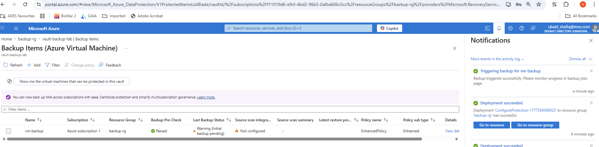
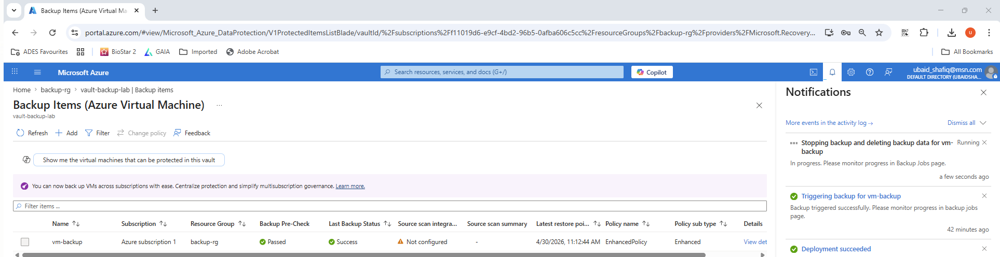
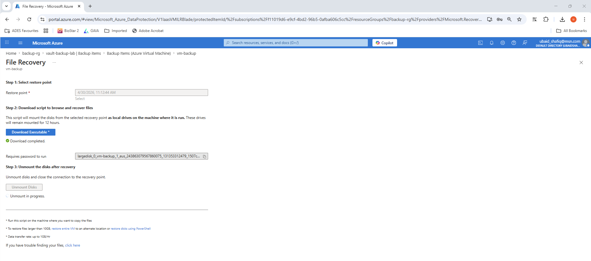
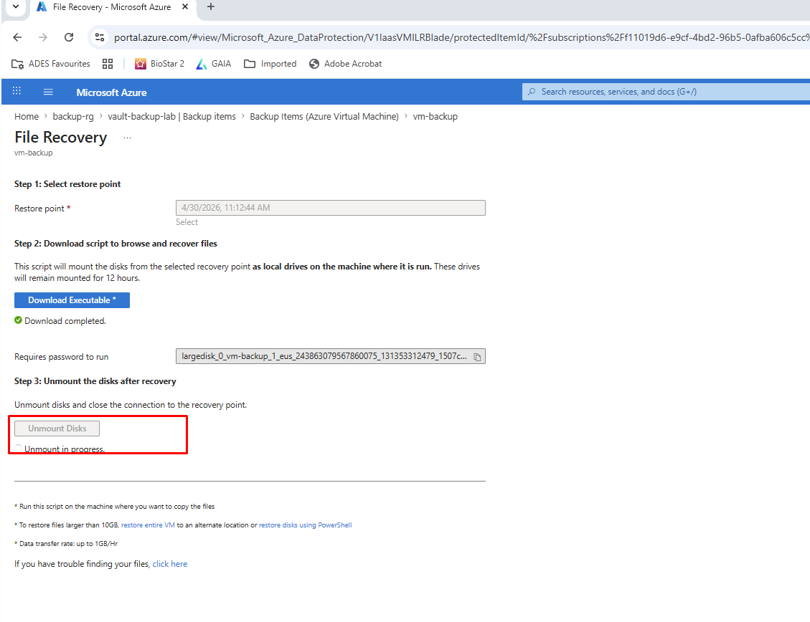
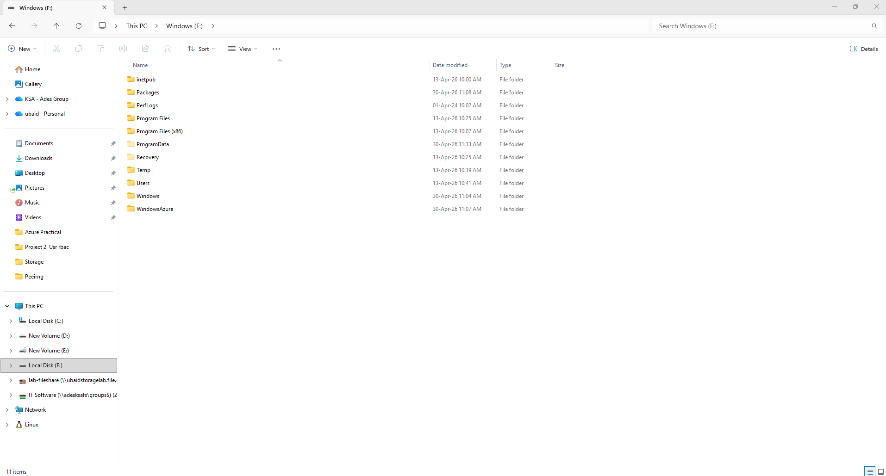
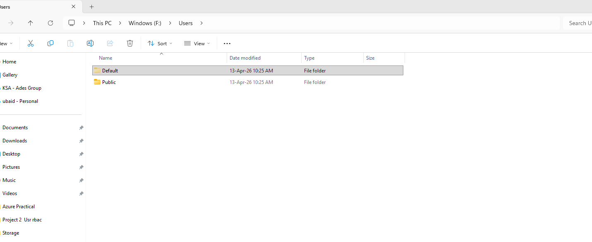

# Azure Recovery Services Vaults & Data Protection Architecture

This repository documents my implementation of business continuity, enterprise data protection policies, and point-in-time state recovery using Azure Backup services.

---

## 🛡️ 1. Recovery Services Vault & Backup Policy Configuration
* **Objective:** Establish automated backup baselines for virtualized enterprise infrastructure.
* **Key Tasks:** Provisioned an Azure Recovery Services Vault and defined retention schemas to meet specific Recovery Point Objectives (RPOs). Scheduled steady-state backups for system states and compute instances.

---

## 🔄 2. Item-Level Recovery & Disk Mounting Lifecycle
* **Objective:** Execute an operational restoration of individual files or folders from a backup restore point without recovering the entire virtual machine.
* **The Process:**
  1. Selected a specific valid recovery point from the backup vault timeline.
  2. Generated and initiated a secure script file to build an iSCSI connection channel.
  3. Downloaded the recovery executable utility directly onto the destination system to temporarily mount the snapshot volume as a local disk.

---

## 📁 3. Restoration Validation
* **Objective:** Verify data-plane volume accessibility to confirm target configurations are fully readable post-mount.

